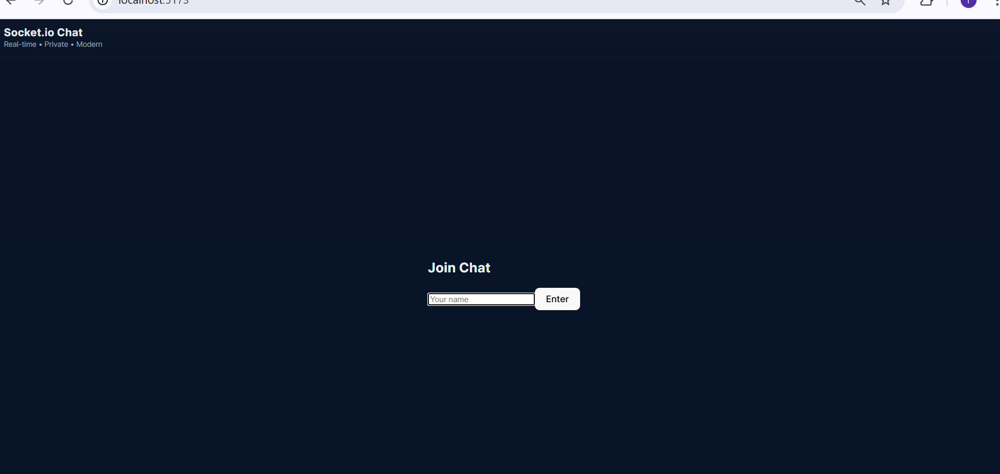

# Socket.io Chat — Modern UI (Final)

A real-time chat application built with **Socket.io**, **Express** (server) and **React + Vite** (client).  
This repo follows a modular structure and includes advanced chat features.

## Live features
- Real-time messaging (public & private)
- Typing indicators (real-time)
- Read receipts (basic)
- User presence (online/offline)
- Responsive modern UI (desktop & mobile friendly)

---

## Screenshots


Desktop view  


Join Chat 



---
## 🚀 Live Demo
Frontend (Client): [https://ferditing-chatroom.netlify.app](https://ferditing-chatroom.netlify.app)

Backend (Server): [https://socket-io-ferditing.onrender.com](https://socket-io-ferditing.onrender.com)


## Local setup

### Server
```bash
cd server
npm install
npm run start


