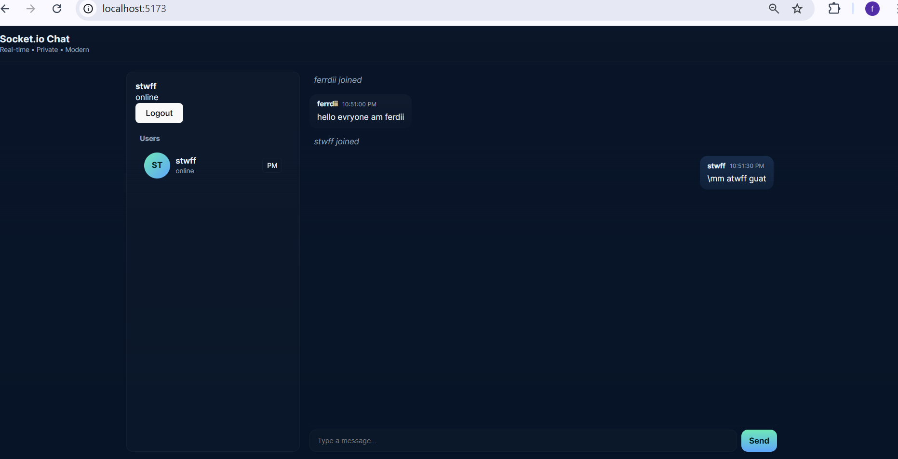

# Socket.io Chat — Modern UI (Final)

A real-time chat application built with **Socket.io**, **Express** (server) and **React + Vite** (client).  
This repo follows a modular structure and includes advanced chat features.

## Live features
- Real-time messaging (public & private)
- Typing indicators (real-time)
- Read receipts (basic)
- User presence (online/offline)
- Responsive modern UI (desktop & mobile friendly)

---

## Screenshots

> Replace `screenshots/` paths with your actual screenshot files.

Desktop view  


Mobile view  


Typing indicator example  


---

## Local setup

### Server
```bash
cd server
npm install
# optionally copy .env.example -> .env (set PORT, CLIENT_URL)
npm run start
